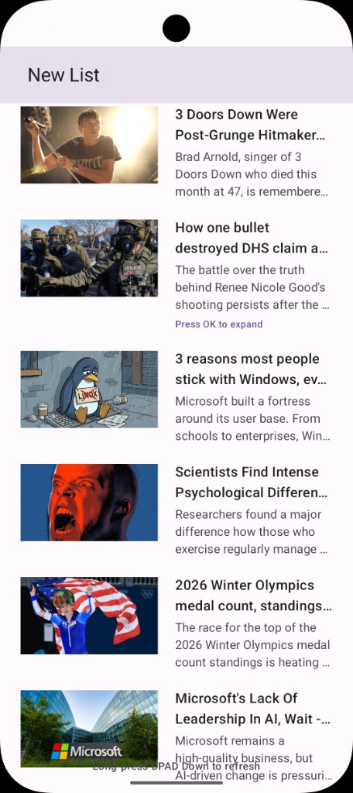

# Lumio Television – News Headlines App

Android TV app that displays news headlines with **long-press DPAD-Down to refresh**. Built with Kotlin, Jetpack Compose for TV, and Retrofit.

## Features

- **News API integration** – Fetches top headlines from [NewsAPI.org](https://newsapi.org/) (US, 30 articles).
- **Retrofit** – All network calls use Retrofit with OkHttp; errors and timeouts are handled.
- **Headlines + summaries** – Each item shows headline and a short summary; **press OK (DPAD center)** on an item to expand and show the full summary.
- **TV-optimized** – Layout and typography tuned for 1080p TV viewport; focusable list for D-pad navigation.
- **Long-press DPAD-Down to refresh** – Hold **DPAD Down** for about 0.8 seconds to refresh headlines. A “Refreshing…” overlay is shown while loading.
- **Article images** – Thumbnails loaded with [Coil](https://coil-kt.github.io/coil/): decoded at display size (320×180) to save memory, with memory + disk cache and crossfade for efficient loading and retention.
- **Offline caching** – Headlines are stored in a **Room** database after each successful fetch. When the app is opened or refreshed without network, cached articles are shown so the list works offline.

## Requirements

- Android SDK 24+ (API 24+)
- Android TV or emulator with TV support
- NewsAPI.org API key (free at [newsapi.org/register](https://newsapi.org/register))

## Setup and run

### 1. Get a News API key

1. Go to [https://newsapi.org/register](https://newsapi.org/register).
2. Register and copy your API key.

### 2. Configure the API key

Use **one** of these options:

**Option A – `local.properties` (recommended, not committed to git)**

In the project root, open or create `local.properties` and add:

```properties
NEWS_API_KEY=your_api_key_here
```

**Option B – `gradle.properties`**

In the project root, open `gradle.properties` and set:

```properties
NEWS_API_KEY=your_api_key_here
```

### 3. Build and run

- Open the project in Android Studio.
- Build: **Build → Make Project** or run `./gradlew assembleDebug`.
- Run on a TV device or **TV emulator** (AVD with a TV profile).  
  The app appears in the launcher as **Lumio Televison** (or the name set in `strings.xml`).

## Usage

- **Navigate** – DPAD Up/Down to move between headlines.
- **Expand summary** – Focus an item and press **DPAD Center (OK)** to expand/collapse the full summary.
- **Refresh** – **Long-press DPAD Down** (~0.8 s) to fetch new headlines. A “Refreshing…” indicator is shown; the list updates when the request completes.

## Project structure

```
app/src/main/java/com/lumio/lumiotelevison/
├── MainActivity.kt              # Long-press DPAD-Down handled here
├── data/
│   ├── model/NewsArticle.kt     # Domain model
│   ├── local/                   # Room DB for offline cache (ArticleEntity, ArticleDao, AppDatabase)
│   ├── remote/                  # Retrofit API, DTOs, OkHttp client
│   └── repository/NewsRepository.kt  # Fetch, Room cache, in-memory fallback
├── ui/
│   ├── NewsViewModel.kt         # UI state, load/refresh
│   ├── NewsViewModelFactory.kt  # Injects repository with Application context for Room
│   ├── components/NewsItem.kt  # Row: image (Coil, size-optimized), headline, expandable summary
│   └── screens/NewsScreen.kt    # List, loading/error, refresh hint
└── ui/theme/                    # TV Material3 theme
```

## Key implementation details

- **Refresh trigger** – `MainActivity.dispatchKeyEvent()` starts a 800 ms timer on `KEYCODE_DPAD_DOWN` down; if the key is still down when the timer fires, `NewsViewModel.loadHeadlines()` is called. On key up, the timer is cancelled so a short press only moves focus.
- **Errors** – Missing API key, HTTP errors, and network failures are surfaced in the UI. When the network fails, the repository returns cached articles from Room if available.
- **Offline** – `NewsRepository.getTopHeadlines()` writes to Room on success and reads from Room on failure, so the app shows the last fetched list when offline.
- **Images** – Coil’s `AsyncImage` with `.size(320, 180)` so images are decoded at display size (memory-efficient). Coil’s default memory and disk caches retain images across scrolls and app restarts.

## Screenshots and video

### App showing news headline list



The screen shows the "New List" top bar, with a scrollable list of articles. Each row includes a thumbnail image, headline, and summary; "Press OK to expand" appears for items with more content. The hint "Long-press DPAD Down to refresh" is shown at the bottom.

For submission, also include:

1. Screenshot of the app showing the headline list (see above).
2. Screenshot or frame showing the “Refreshing…” state (during long-press DPAD-Down).
3. Short video: navigate list → long-press DPAD-Down → refreshed headlines.

## License

This project is for assignment/portfolio use. NewsAPI.org terms apply to the data.
# lumioTelevision
